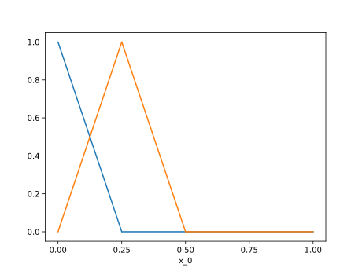
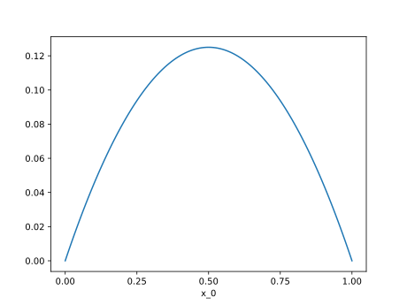
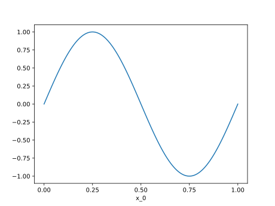
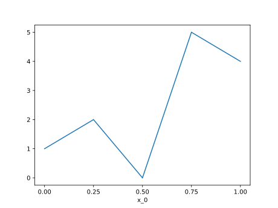

# Functions

A *function* in Nutils is a mapping from a topology onto an n-dimensional
array, and comes in the form of a functions: `nutils.function.Array` object. It
is not to be confused with Python's own function objects, which operate on the
space of general Python objects. Two examples of Nutils functions have already
made the scene: the geometry `geom`, as returned by `nutils.mesh.rectilinear`,
and the bases generated by `Topology.basis()`. Though seemingly different,
these two constructs are members of the same class and in fact fully
interoperable.

The `nutils.function.Array` functions behave very much like `numpy.ndarray`
objects: the functions have a `nutils.function.Array.shape`,
`nutils.function.Array.ndim` and a `nutils.function.Array.dtype`:

```python
geom.shape
# (1,)
basis.shape
# (5,)
geom.ndim
# 1
geom.dtype
# <class 'float'>
```

The functions support numpy-style indexing.  For example, to get the first
element of the geometry `geom` you can write `geom[0]` and to select the first
two basis functions you can write

```python
plot_line(basis[:2])
```


The usual unary and binary operators are available:

```python
plot_line(geom[0]*(1-geom[0])/2)
```


Several trigonometric functions are defined in the `nutils.function` module.
An example with a sine function:

```python
plot_line(function.sin(2*geom[0]*numpy.pi))
```


The dot product is available via `nutils.function.dot`. To contract the basis
with an arbitrary coefficient vector:

```python
plot_line(function.dot(basis, [1,2,0,5,4]))
```


Recalling the definition of the [discrete
solution](theory.md#discrete-solution), the above is precisely the way to
evaluate the resulting function. What remains now is to establish the
coefficients for which this function solves the Laplace problem.

## Arguments

A discrete model is often written in terms of an unknown, or a vector of
unknowns.  In Nutils this translates to a function argument,
`nutils.function.Argument`. Usually an argument is used in an inner product
with a basis. For this purpose there exists the `nutils.function.dotarg`
function. For example, the [discrete solution](theory.md#discrete-solution) can
be written as

```python
ns.u = function.dotarg('lhs', ns.basis)
```

with the argument identified by `'lhs'` the vector of unknowns \\( \hat{u}_n
\)).
